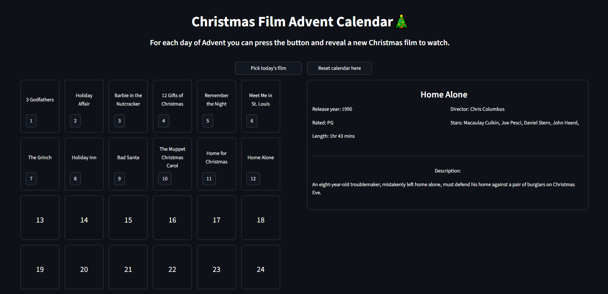

# Christmas Movie Advent Calendar 🎄

*Built with Python and Streamlit*

---

Interactive web application that picks a random Christmas film every day of December leading up to Christmas. 
The film is chosen from a dataset of Christmas movies, and once selected it cannot be picked again.  

The project also includes some small data science components such as:

- Pandas for database analysis and preprocessing
- Streamlit for UI interactivity

### Dataset
The original dataset was sourced from Kaggle:
[https://www.kaggle.com/datasets/jonbown/christmas-movies]

This repository includes :
- data_cleaning.py - The script used to preprocess and filter the dataset.
- cleaned_movies.cvs - The final curated dataset used in the streamlit application

The cleaned dataset contains 102 Christams films filtered by vote count, film rating and whether the row had complete data.

